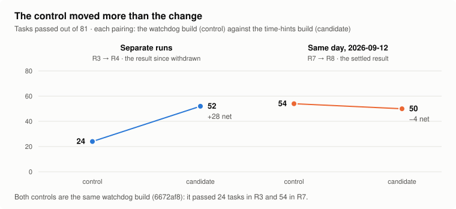
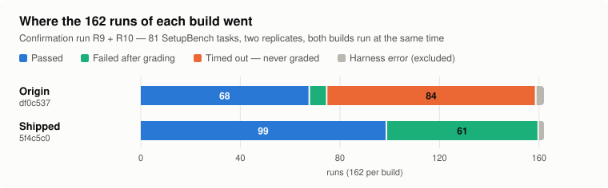

# How NEO Stopped a Coding Agent From Dying on the Clock

*NEO, our autonomous engineering agent, took a coding agent from 67 to 98 passed runs out of 157 on real setup tasks. Most of that came from making sure the agent's work reached the grader. Along the way NEO promoted a second fix, caught its own control having a bad day, and withdrew the claim. The withdrawal is as useful as the win.*

The system we optimized is [Ada](https://github.com/rabbah/ada), an open-source coding agent built on Claude Code by Simon Guerrier, Rodric Rabbah and contributors. You give it a task in plain English, such as *install the dependencies and make the tests pass*. It works through the task in a sandbox: it runs commands, edits files and checks its own results.

A typical failing run, as the campaign's report describes it, went like this: Ada had an eight-minute budget and worked well for seven minutes. It installed packages, fixed a config and started a service. Then, with a minute left, it began a `sleep 300` poll or a fresh debugging tangent. The budget ran out mid-flight, the harness killed the container, and the task was scored as a failure.

The grader never ran, so everything Ada had done was thrown away.

Nothing looked broken: there was no crash in Ada and no error in the model. The agent simply did not know the deadline was coming. According to the campaign's record, the budget was stated once at the start and never updated.

That is a dangerous failure for any agent that works against a time limit. A crash gets noticed, but a run that does most of the work and then vanishes looks exactly like a run that did nothing.

This is what survived the campaign.

- Four changes, including a watchdog that stops Ada cleanly before the deadline, took it from **67/157 to 98/157** passed runs. A pass rule written into the launch script confirmed it.
- Almost all of the gain is runs the original build lost to the clock. On the runs it did get graded, the difference is not significant. No run separates the four changes, so which of them did the work is not known.
- A second fix, telling Ada how much time it had left, did what it was designed to do but did not raise the pass rate.
- Two headline numbers were published during the campaign and then withdrawn by NEO itself, both for the same reason.
- On a second benchmark, Terminal-Bench 2.0, an earlier build tied the original.

Four builds of Ada are compared throughout, and these are the names used for them:

- **Origin:** Ada as the campaign found it, commit `df0c537`.
- **Watchdog:** the origin plus Phase A's changes and a clean exit, commit `6672af8`. Phase A added a time-aware prompt, a thinking cap, a container-anchored deadline and the watchdog.
- **Time hints:** the watchdog build plus the time-awareness change, commit `2e495bb`.
- **Shipped:** the time-hints build with the time hints switched off, commit `5f4c5c0`. It was measured directly as commit `1d82e56`, which has the same agent code and later documentation.

## What Ada does

Ada is a wrapper around a Claude Code session. A small service starts the session through the Claude Agent SDK and gives it its own writable workspace. It streams everything the session does to whatever is listening: a Slack thread, a web chat or any frontend that speaks AG-UI. The stream carries the session's messages, each tool call and each result, and follow-up messages continue the same session in the same workspace.

The spawned agent runs with a scrubbed environment: only essentials such as the path, the model credential and the user's GitHub token are forwarded. So a command the model runs cannot read the host's secrets, and the code is in [`ada/`](ada/). [`ada/README.md`](ada/README.md) covers running it: a demo that needs no API key, a local run against the real SDK, and deployment on the Astro platform.

In this campaign Ada ran `z-ai/glm-5.3-flash` through OpenRouter, not a Claude model, and a benchmark harness drove it headlessly.

```text
harness     for each task: start the task's own Docker container
            copy Ada in, give it the task, start the clock (480 s)
                │
Ada         Claude Agent SDK loop ──► z-ai/glm-5.3-flash via OpenRouter
            tools run inside the container: shell, file edits, installs, services
                │
harness     Ada exits before the deadline ──► run the task's success command ──► pass / fail
            deadline passes first          ──► timed out: the grader never runs  ──► fail
```

The last line is the whole story: a run that overran was not partly right, because it was never looked at.

The watchdog changes that: it interrupts Ada 30 seconds before the budget runs out, counted from the moment the container started. On a 480-second task that is the 450-second mark, after which Ada exits cleanly and the grader scores whatever it has done. In the rest of this article, "interrupted by the watchdog" means exactly that cut-off.

The changes all live in two files of [`ada/agent/`](ada/agent/):

| Change | Where it lives in `ada/` | Status |
|---|---|---|
| System prompt that adapts to the time budget | `agent/system-guidance.ts` | ships |
| Thinking cap of 1,024 tokens by default | `agent/claude/agent.ts` | ships |
| Watchdog and a deadline anchored to the container's start | `agent/claude/agent.ts` | ships |
| Clean exit after the watchdog interrupt (T0.1) | `agent/claude/agent.ts` | ships |
| "Definition of done" prompt section (T1.1) | `agent/system-guidance.ts` | ships switched off |
| Time hints, wrap-up instruction, Bash timeout clamp (T1.2) | `agent/claude/agent.ts` | ships switched off |

## How it was measured

The benchmark is [SetupBench](https://github.com/microsoft/SetupBench), where each task is a real repository with a job to do, such as installing dependencies or configuring a database. A success command written by the benchmark's authors decides pass or fail. The campaign used 81 of its tasks, each with a 480-second budget.

The harness is in [`bench/harness/`](bench/harness/). For every task it records whether the grader passed it, how many turns Ada took, how long it ran and whether it timed out. Every run also records the model, the budget, the SetupBench commit and the SHA-256 of both harness scripts.

The runner that launches Ada inside the container is byte-identical to the one in `bench/harness/` in every run. The evaluator that drives the runs and calls the grader changed during the campaign. The exact versions that scored the runs were not kept, and the one in `bench/harness/` matches none of the versions the runs recorded.

Two builds are compared on the same tasks, task by task, with an exact McNemar test on the tasks where they disagree. The runs up to R8 ran four tasks at a time; the confirmation ran one task at a time per build. Its two builds and two replicates overlapped, so up to four containers ran at once.

One rule was learned the hard way and is described below: **both builds must run side by side, at the same time.** Every scored run is listed with its ID in [`bench/RUN_REGISTRY.md`](bench/RUN_REGISTRY.md). Every document in the campaign names its runs by those IDs, and [`bench/README.md`](bench/README.md) says which file holds what.

## The first full run: killed by the clock

The first full run of the origin build (R1) passed 27 of 81 tasks and timed out on 53. Every timeout was a zero: the harness never graded the work.

NEO's first fix, in Phase A, went after the clock directly: a watchdog interrupts the agent before the harness would kill it. Later in the phase, the deadline was anchored to the container's start rather than the agent's, so the two clocks agree. The same phase replaced the prompt with guidance that adapts to the time budget and set a thinking cap. An early watchdog build cut timeouts from 53 to 3.

The interrupt still ended badly: after it fired, Ada crashed instead of exiting, so its runner never reported a result. So 43 runs were recorded with zero turns, although 41 of them were still graded and 19 passed. Two runs hung until the harness killed them. The clean-exit fix (T0.1) made Ada finish properly after the interrupt, and neither full run of that build recorded a zero-turn run.

## The watchdog build, measured on one day

On 2026-09-12 NEO ran three builds on all 81 tasks, one after another, with the same harness:

| Build | What it adds | Passed | Against the row above |
|---|---|---:|---|
| Origin `df0c537` | nothing | 34/81 | n/a |
| Watchdog `6672af8` | Phase A's changes and the clean exit | **54/81** | **+20**, 21 gained / 1 lost, p = 1.1e-05 |
| Time hints `2e495bb` | time hints, wrap-up instruction, Bash clamp | 50/81 | **−4**, 5 gained / 9 lost, p = 0.42 |

The gain is entirely on one kind of task. On that day the origin build timed out on 45 of the 81 tasks, and the watchdog build passed 21 of those 45. On the 36 tasks the origin build finished in time, it had already passed 34, and nothing built since has improved on that.

## Two ideas that did not work

Before the time hints, NEO tried two changes that asked the model to behave differently.

The first was a careful "definition of done" section in the prompt. It told the model to reproduce paths, ports and values exactly and to use the project's own toolchain. It also said to run the success check in a fresh shell before claiming victory. The model provably received it, yet it converted none of the ten failing tasks it was written for. On a 12-task paired check it scored 2 against the control's 3, and it ships switched off.

The second was to make the model think less, because the record says thinking tokens took up to 93% of its output on some runs. The record says its probe ([`ada/scripts/probe-thinking.ts`](ada/scripts/probe-thinking.ts)) hit three dead ends. The gateway rejects turning thinking off, and a low-effort setting had no effect. A thinking budget worked at the raw API level, but the SDK path Ada uses never forwards it. The probe's output was not kept, and NEO dropped the idea before spending anything on an evaluation.

## The time hints: a working mechanism that did not help

The third idea did not ask the model to change; it gave the model a fact it provably lacked. Before every model request, a hook inserts a line such as `⏱ 78 s of 120 s remain.`, taken here from the smoke test with its 120-second budget. Near the end, the line becomes an instruction to stop exploring and make the success command pass. And any Bash command's timeout is capped, so a single `sleep` cannot eat the rest of the budget.

The mechanism works: asked to quote any timing note it had seen, the model repeated the hint word for word ([`ada/evidence/t12/t12_smoke_a1_log.txt`](ada/evidence/t12/t12_smoke_a1_log.txt)). Runs interrupted by the watchdog fell from 34 to 7, turns fell 10.6%, and wall time fell 5.0%. The agent really does pace itself once it can see the clock.

It does not pass more tasks: on the same day as the watchdog build, the time-hints build scored 50/81 against 54/81. That −4 is inside the noise, so it is no measured benefit rather than measured harm, and where it lost is telling. On the 47 tasks where the watchdog build finished with time to spare, the time-hints build went from 42 passes to 37. The wrap-up instruction reached tasks that were never in trouble and told them to stop.

It also changed how Ada fails. Of the time-hints build's 31 failures, 25 ended with Ada announcing the task was done while the grader's command failed. For the watchdog build it was 5 of 27, so the hints make Ada declare more tasks finished, not finish more.

So the time hints are an efficiency result, not an accuracy result, and they are reported as one.

## Two numbers NEO took back

The time hints had not always looked like this. In a result since withdrawn, they were first reported at **52/81 against 24/81, +28, p = 7.66e-07**, and promoted.

The withdrawn result's 24/81 was a control run of the watchdog build (R3). It was measured before the time-hints run it was compared with, rather than alongside it.

On 2026-09-12 the same build scored 54/81 on the same tasks: 30 tasks better and none worse, p = 1.9e-09. It took almost the same number of turns (1,544 against 1,554). The 24/81 control was a depressed run: the watchdog interrupted 63 of its runs against 34, and it ran 23% longer for no recorded reason. A control that moves 30 tasks on its own cannot anchor a claim of 28.



*Tasks passed out of 81. In separate runs, the watchdog build scored 24 and the time-hints build 52: +28 net, since withdrawn. On the same day, 2026-09-12, they scored 54 and 50: −4 net. The watchdog build is the control in both pairings.*

The first headline to go was Phase A's: 27/81 to 59/81. That 59 was assembled from 50 passes carried over from earlier runs plus a re-run of only the 31 failures. Run fresh and whole on one day, the same line of builds scores 54/81 against the origin's 34/81, so NEO withdrew that too.

Both failures are the same failure: a comparison whose arms were not measured together. One carried scores across protocols; the other set a candidate against a control run before it. After the second, NEO made same-day paired runs the only admissible evidence. It also built the run registry, so no document can say "the control" without saying which run. The confirmation that followed went further and ran both arms at the same time.

## Confirming what was left

The build that ships is the time-hints build with the hints switched off. NEO did not assume it would score like the watchdog build; it measured it.

On 2026-09-15 it ran the origin build and the shipped build side by side, twice, on all 81 tasks each time. The run had four rules: both replicates must complete, and each must gain at least 10 tasks net. Neither arm may lose more than three rows to harness errors, and the pooled exact McNemar test must reach p < 0.001.

The rules are written at the top of the script that launched the run ([`bench/run_baseline_vs_best.sh`](bench/run_baseline_vs_best.sh)). The run's log shows that script applying them when the run finished, but no timestamped copy of the rules predates the run. So "written down in advance" rests on that script and on the campaign's record.

| Confirmation run | Tasks that could be paired | Origin | Shipped | Net | p |
|---|---:|---:|---:|---:|---|
| R9 | 79 | 31 | **47** | +16 | 1.45e-04 |
| R10 | 78 | 36 | **51** | +15 | 6.10e-05 |
| **Pooled** | **157** | **67** | **98** | **+31** | **7.92e-09** |

All four rules are met, with 32 runs gained and 1 lost. Paired counts leave out any task where either build hit a harness error, so R9 pairs 79 tasks and R10 pairs 78. Out of 81, the origin passed 32 and 36, and the shipped build passed 47 and 52.

The decomposition is the clearest result of the campaign. On the 83 paired runs where the origin build timed out, the shipped build passed 29. Of those, 18 passed after its watchdog stopped it, and 11 finished in time on their own. On the 74 where the origin build was graded, the two builds passed 67 and 69 (p = 0.625), not a significant difference.



*Each bar is one build's 162 runs in the confirmation. Origin: 68 passed, 7 failed after grading, 84 timed out, 3 harness errors. Shipped: 99 passed, 61 failed after grading, 0 timed out, 2 harness errors. The orange block is the runs the grader never saw. In the shipped build it is gone: 54 more runs fail after grading and 31 more pass.*

Here is the confirmation run in full, computed from its four raw result files by `python3 bench/confirmation_table.py`. A pair is one task in one replicate, counted only when neither build hit a harness error.

| Measure | Origin `df0c537` | Shipped `5f4c5c0` | Difference |
|---|---:|---:|---|
| Attempts passed, out of all 162 | 68 (42.0%) | **99 (61.1%)** | +31 |
| Pairs passed, out of 157 pairs | 67 | **98** | 32 gained, 1 lost; exact McNemar p = 7.92e-09 |
| Timed out, so never graded | 84 | **0** | −84 |
| Stopped by the watchdog, then graded | 0 | 69 | 23 of the 69 passed |
| Harness errors, left out of the pairs | 3 | 2 | |

## Beyond SetupBench

On Terminal-Bench 2.0, a second benchmark, NEO compared the origin build with Phase A's final build (`08a8d5d`) on 40 public tasks. Two tasks were excluded because the verifier's own infrastructure failed: a package mirror returned 404 and a tool was missing. That says nothing about the agent, and both were origin passes, so the raw count is 28/40 against 26/40.

On the remaining 38 the two builds tied, 26 against 26, p = 1.0. The two arms ran three days apart, which the campaign's own rule would not now admit. The efficiency carried over, with 40% fewer turns and 34% less execution time on the 38 tasks. The pass-rate gain did not, and the shipped build has not been run outside SetupBench.

## Where the remaining gap is

After the confirmation, NEO asked whether the 25 tasks the shipped build failed in both confirmation replicates were slow or hard. It re-ran them at twice the budget, 960 seconds, and seven passed, which is MIXED by the rule it had written down beforehand.

One more candidate, P3, was a later wrap-up aimed at the runs that were still being interrupted. It gained 2 across two replicates (p = 0.6875) and failed its pre-registered gate. Two others were dropped without spending anything, on the reading that the clock no longer cut runs off. P2, the Bash timeout clamp, was only ever measured inside the time-hints bundle (−4) and never on its own; P4 never ran.

That reading does not survive a look at the raw rows: the harness killed nothing, because the watchdog stops Ada first. But the watchdog interrupted 28 of the shipped build's 41 failures in that run. At 960 seconds it interrupted 8 of the 17 failures, 30 seconds before the longer budget ran out. So P2 and P4 are untested, not refuted, and whether the remaining gap is time or capability is still open.

## What this experiment can and cannot claim

The evidence supports three claims.

- The shipped build passes more SetupBench tasks than the origin build: 98/157 against 67/157 on paired runs, under rules written down in advance.
- Nearly all of the gain comes from runs that were killed before grading. It is not a gain in the agent's ability on tasks it could already attempt.
- The time hints make Ada use its time more efficiently without raising its pass rate.

It does not establish that Ada is a more capable agent, or any gain outside SetupBench. The shipped build was never run elsewhere, and the one external comparison was a tie. The confirmation run's diagnostics record no token counts or spend, so it has no measured cost. And all 81 tasks come from one benchmark, graded by its authors' success commands.

A re-check of the raw data before publication found errors in the campaign's own records. They misdate the withdrawn control run, overstate how identical its work was, and misread Phase C's clock-outs. The corrections are in the README, under "Re-checked against the raw data".

## What this approach demonstrates

**The control is a measurement too:** the same build scored 24/81 and 54/81 on different days, with almost the same number of turns. Every withdrawn headline in this campaign rested on a comparison whose arms were not measured together. Statistics on the candidate cannot fix a control that did not run alongside it.

**A small p-value is not a shield against a bad design.** The withdrawn comparison had p = 7.66e-07, and its 95% confidence interval ran from +19 to +48 points ([`bench/T12_REM81_PAIRED_ANALYSIS.json`](bench/T12_REM81_PAIRED_ANALYSIS.json)). Both were computed correctly, and they answered whether two particular runs differed, and they did, but not because of the code.

**Keep efficiency and accuracy apart:** the time hints cut runs interrupted by the watchdog by 79%. That is real and worth having, but it is not a pass-rate gain. One number that blends the two is how a change gets promoted on evidence it does not have.

**A working mechanism is not a working change:** the model received the hint, quoted it, and paced itself. It did exactly what it was asked and did not get better at the task.

**Look at what the grader actually sees.** The biggest gain in the campaign came from noticing that most of the original build's failures were never graded at all. In the confirmation, 84 of its 94 failed runs were timeouts the grader never saw.

## Check it yourself

Every number in this article traces to a file in this repository. The first script below checks each result against the raw per-task diagnostics or the file it cites, and against the text. All of them need nothing but Python 3.

```bash
python3 bench/verify_docs.py                        # every result in this article and the README
python3 bench/baseline_vs_best_verify.py            # the confirmation run (R9/R10)
python3 bench/ctrl_vs_t12_verify.py                 # the same-day ladder and the run registry
python3 bench/fresh_rem81_verify.py                 # the 2026-09-12 morning run
python3 bench/harness/archive_integrity_check.py    # every archived run against the registry
python3 bench/confirmation_table.py                 # the full confirmation table above
```

`bash bench/verify_builds.sh` also recovers the exact commit behind each build and checks its code, given git and network access.

Three of the scripts check this article: `verify_docs.py` fails if any figure here stops matching the data. `baseline_vs_best_verify.py` fails if the confirmation result stops being quoted. `ctrl_vs_t12_verify.py` fails if a withdrawn figure appears without being marked as withdrawn.

A few statements rest on the campaign's written record rather than on stored data. These are the typical failing run, the budget being stated once, the thinking-token share and the probe's findings, each marked where it appears. The full record is [`ada/RESULTS.md`](ada/RESULTS.md), and the campaign's own narrative is [`ada/REPORT.md`](ada/REPORT.md).

## What the optimization delivered

Ada now stops itself cleanly before its deadline, so the work it has done is graded. With the other changes, the shipped build went from 67 to 98 passed runs out of 157 on SetupBench. It also went from 84 runs the harness killed without grading to none. On the tasks the original build finished, it is no better; the gain is in the tasks the original ran out of time on.

NEO did the failure analysis, the changes, the paired evaluations and the run registry. It also ran the confirmation and the probes that followed, and withdrew its own numbers twice when they did not hold.

**[NEO: Your Autonomous AI Engineering Agent](https://heyneo.com)**

[](https://marketplace.visualstudio.com/items?itemName=NeoResearchInc.heyneo)
[](https://marketplace.cursorapi.com/items/?itemName=NeoResearchInc.heyneo)
[](https://docs.heyneo.com/neo-mcp)
